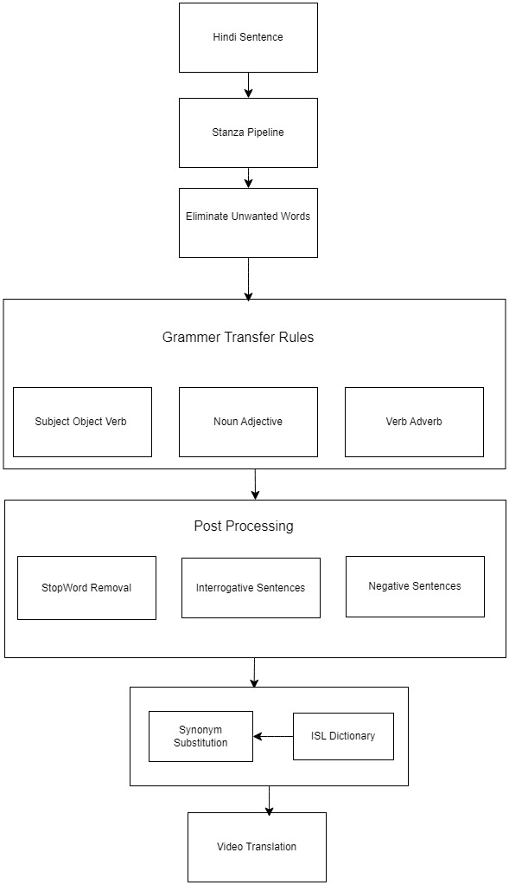

# CS 689A Project - Hindi To Indian Sign Language: Rule-Based Translation System
### Done by
1. Yashvir Singh Nathawat(231110059)
2. Kartik Jain (231110023)
3. Aditya Katare (231110005)

### Project Workflow

#### DataSet Used :
1. Indian Sign Language Videos
Link - https://drive.google.com/drive/folders/1U-Pr4r1-cupgNOOq9NH_uTsQnPSVEKco

2. Hindi Sentences for checking on random hindi sentences
Link - https://www.kaggle.com/datasets/shivamjha0306/english-to-hindi-dataset

#### File Used
1. final_stopwords.txt - Contains filtered Stopwords for ISL Grammer

2. isl_dict.txt - It contains video names of ISL in mapping from english to hindi which is translated

3. known_pos_tag - It contains pos tags which is given by stanza pipeline

4. main.ipynb - It contains the main file

5. test_results.pdf - This file contains the results of our model on same category wise data.

***************************PLEASE READ ******************************************************************
**** NOTE:
1. Make sure the videos are on local system and path to videos is edited in main.ipynb
2. pyiwn error : After installing there will be some error related open() function in python in pyiwn.py file which is downloaded when we install it. Simply put encoding='utf8' in the
   arguments to resolve the issue.
3. In videos folder, add all the ISL videos download from drive. Inside Videos folder, named folder like A(contains words starting with A) and so on this is downloaded from ISL website.
   In videos folder we have provided videos manually recorded by us
   Finally add the videos folder path to main.ipynb
   

#### Steps to run the Code
1. Install Dependencies
2. Make sure videos path 
2. Run main.ipynb
3. A video will be generated at the end.
4. Play it.

#### Imports
1. stanza
2. nlp
3. pandas
4. googletrans
5. pyiwn
6. spacy lemmatizer en_core_web_sm

